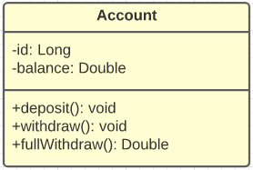

# JUnit, aprendizado

Este repositório foi criado para evidenciar o aprendizado dos testes em JUnite feito por mim, no qual criei uma simples classe que simula uma conta bancária, fazendo os devidos testes nos métodos da classe com o objetivo de verificar se o resultado estava sendo o esperado:

O teste foram feitos de forma **vanilla** (Sem framework) utilizando a versão 5 do JUnit

## Testes

Para fazer os testes,a seguinte estrutura foi criada:

A seguir, demostrarei os métodos testados:

Verifica se o método **deposit()** está diminuindo o valor do saldo quando um valor positivo é passado por parâmetro.

---

Verifica se o método **deposit()** não faz nenhuma alteração caso seja passado um valor negativo.

---

Verifica se o método **withdraw()** está retirando o valor do **saque** quando o valor do **saldo** for sufciente

---

Verifica se o método **fullWithdraw()** está retirando o saldo total da conta e retornando o valor saque total.

---

Verifica se o método **withdraw()** está lançando uma exceção caso o valor do saque for maior do que o saldo